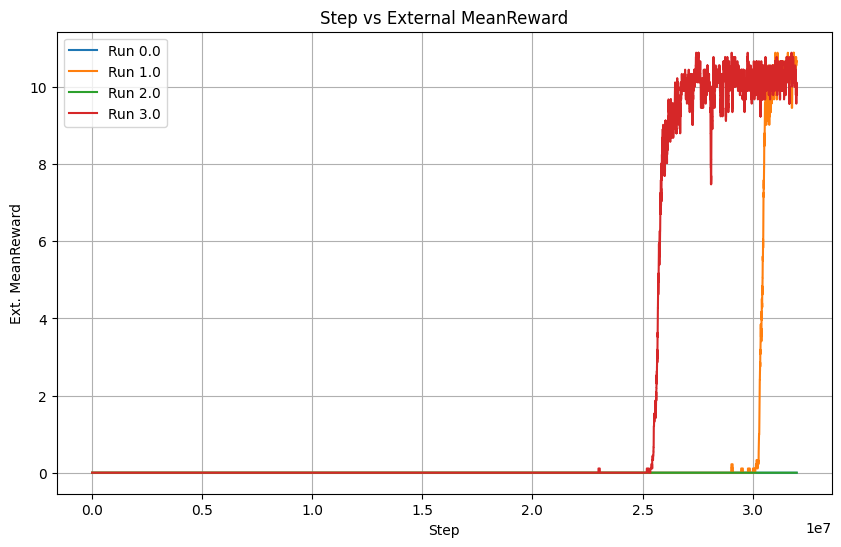
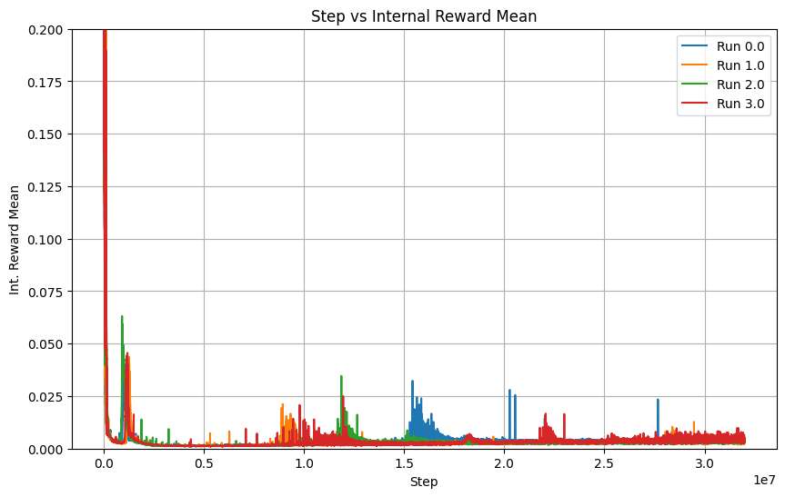
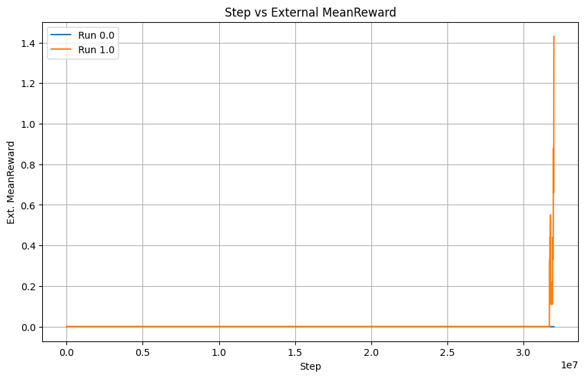
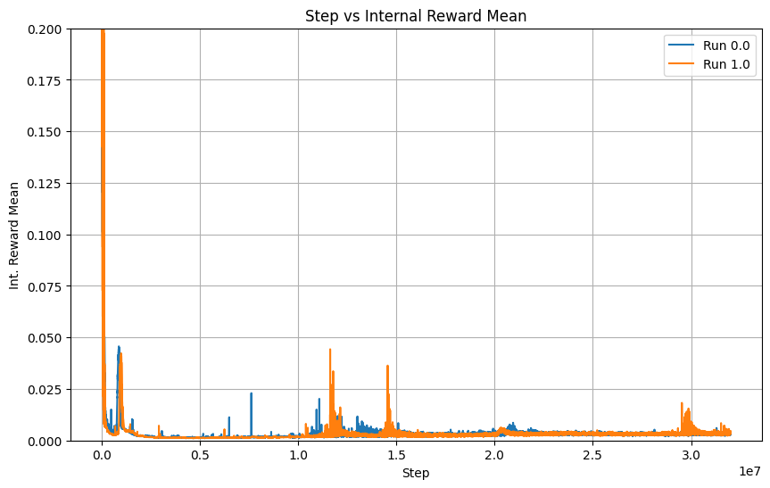

### 条件
モデル変更なし
climber config 8

### 実験パラメータ

```
    "8": {
      "model": "snd",
      "type": "vanilla",
      "n_env": 128,
      "trials": 4,
      "steps": 32,
      "gamma": "0.998,0.99",
      "beta": 0.001,
      "batch_size": 512,
      "trajectory_size": 16384,
      "ppo_epochs": 4,
      "lr": 0.0001,
      "actor_loss_weight": 1,
      "critic_loss_weight": 0.5,
      "motivation_lr": 0.0001,
      "motivation_eta": 0.5,
      "cnd_error_k": 2,
      "cnd_loss_k": 2,
      "cnd_preprocess": 0,
      "cnd_loss_pred": 1,
      "cnd_loss_target": 1,
      "cnd_loss_target_reg": 0.0001
    },
 ```

### 結果




### 条件
衝突時に内因性報酬にマイナスをかける
climber config 8

### 実験パラメータ

```
    "8": {
      "model": "snd",
      "type": "vanilla",
      "n_env": 128,
      "trials": 2,
      "steps": 32,
      "gamma": "0.998,0.99",
      "beta": 0.001,
      "batch_size": 512,
      "trajectory_size": 16384,
      "ppo_epochs": 4,
      "lr": 0.0001,
      "actor_loss_weight": 1,
      "critic_loss_weight": 0.5,
      "motivation_lr": 0.0001,
      "motivation_eta": 0.5,
      "cnd_error_k": 2,
      "cnd_loss_k": 2,
      "cnd_preprocess": 0,
      "cnd_loss_pred": 1,
      "cnd_loss_target": 1,
      "cnd_loss_target_reg": 0.0001
    },
 ```

### 結果


